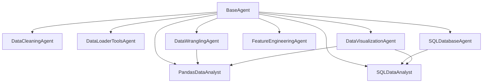
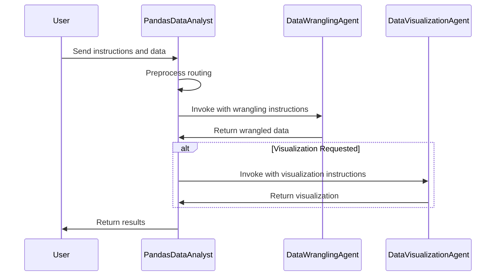

# AI Agent Ecosystem Map

## Agent Hierarchy Overview

## Agent Implementations

### Base Agent
- **BaseAgent**: The foundation class that extends `CompiledStateGraph` from LangGraph, providing common functionality for state management, parameter handling, and graph operations.

### Individual Agents
These are standalone agents that handle specific tasks in the data science workflow:

1. **DataCleaningAgent**: Processes datasets based on user-defined instructions or default cleaning steps.
   - **Independence**: Independent. Can be used as a standalone agent.
   - **Core Functions**: Removing columns with high missing values, imputing missing values, converting data types, removing duplicates and outliers.

2. **DataLoaderToolsAgent**: Handles data loading operations from various sources.
   - **Independence**: Independent. Can be used as a standalone agent.
   - **Core Functions**: Loading data from files, databases, or APIs.

3. **DataVisualizationAgent**: Creates data visualizations using Plotly.
   - **Independence**: Can be independent or used as a component in multiagents.
   - **Core Functions**: Creating charts, plots, and visualizations from data.

4. **DataWranglingAgent**: Transforms and manipulates data for analysis.
   - **Independence**: Can be independent or used as a component in multiagents.
   - **Core Functions**: Data transformation, aggregation, filtering, and preparation.

5. **FeatureEngineeringAgent**: Creates new features from existing data for machine learning models.
   - **Independence**: Independent. Can be used as a standalone agent.
   - **Core Functions**: Feature creation, transformation, normalization, encoding.

6. **SQLDatabaseAgent**: Interacts with SQL databases to query and manipulate data.
   - **Independence**: Can be independent or used as a component in multiagents.
   - **Core Functions**: SQL query generation, database interaction, data retrieval.

### Multiagents
These agents compose individual agents to create more complex, end-to-end workflows:

1. **PandasDataAnalyst**: Combines data wrangling and visualization capabilities.
   - **Components**: DataWranglingAgent, DataVisualizationAgent
   - **Workflow**: Routes user instructions to the appropriate component agent, processes data through the wrangling agent, and then visualizes the results if requested.

2. **SQLDataAnalyst**: Combines SQL database operations with visualization capabilities.
   - **Components**: SQLDatabaseAgent, DataVisualizationAgent
   - **Workflow**: Executes SQL queries through the database agent and visualizes the results using the visualization agent.

## Communication Flows

## Agent Dependencies and Requirements

Each agent requires:
1. A language model (LLM) for code generation and reasoning
2. Type-specific parameters (e.g., database connection for SQL agents)
3. Optional checkpointer for state persistence

## Implementation Considerations for uAgents

When reimplementing these agents with Fetch.ai uAgents:

1. Each agent should be implemented as a separate uAgent with clearly defined protocol handlers
2. State management should use uAgent's built-in state mechanisms instead of LangGraph's
3. Communication between agents should use uAgent's message passing instead of direct invocation
4. Checkpointing would be replaced by uAgent's persistence capabilities

## Independent vs. Dependent Agents

Independent agents (can operate standalone):
- DataCleaningAgent
- DataLoaderToolsAgent
- FeatureEngineeringAgent
- DataVisualizationAgent (can be both)
- DataWranglingAgent (can be both)
- SQLDatabaseAgent (can be both)

Dependent agents (require other agents):
- PandasDataAnalyst (depends on DataWranglingAgent and DataVisualizationAgent)
- SQLDataAnalyst (depends on SQLDatabaseAgent and DataVisualizationAgent) 