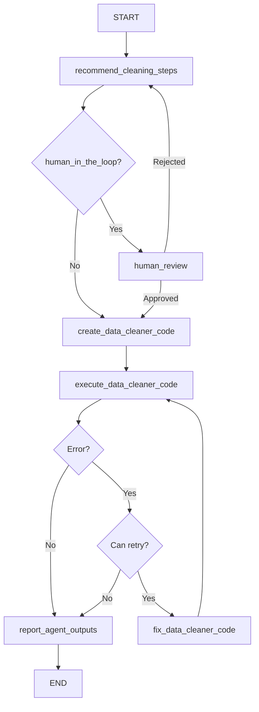

# DataCleaningAgent

## Purpose & Responsibilities

The DataCleaningAgent is responsible for processing datasets based on user-defined instructions or default cleaning steps. It generates Python code to clean data, executes the code, and provides the cleaned dataset as output. The agent is designed to facilitate reproducible and customizable data cleaning workflows with minimal user effort.

Default cleaning steps include:
- Removing columns with more than 40% missing values
- Imputing missing values with the mean for numeric columns
- Imputing missing values with the mode for categorical columns
- Converting columns to appropriate data types
- Removing duplicate rows
- Removing rows with missing values
- Removing rows with extreme outliers (values 3x the interquartile range)

Users can modify these steps through custom instructions, allowing for tailored data cleaning processes.

## Core Implementation

The DataCleaningAgent extends the BaseAgent class and implements a state graph for data cleaning:

```python
class DataCleaningAgent(BaseAgent):
    def __init__(
        self, 
        model, 
        n_samples=30, 
        log=False, 
        log_path=None, 
        file_name="data_cleaner.py", 
        function_name="data_cleaner",
        overwrite=True, 
        human_in_the_loop=False, 
        bypass_recommended_steps=False, 
        bypass_explain_code=False,
        checkpointer: Checkpointer = None
    ):
        self._params = {
            "model": model,
            "n_samples": n_samples,
            "log": log,
            "log_path": log_path,
            "file_name": file_name,
            "function_name": function_name,
            "overwrite": overwrite,
            "human_in_the_loop": human_in_the_loop,
            "bypass_recommended_steps": bypass_recommended_steps,
            "bypass_explain_code": bypass_explain_code,
            "checkpointer": checkpointer
        }
        self._compiled_graph = self._make_compiled_graph()
        self.response = None

    def _make_compiled_graph(self):
        self.response = None
        return make_data_cleaning_agent(**self._params)
```

The agent uses the `make_data_cleaning_agent` factory function to create a state graph with nodes for:
1. Recommending cleaning steps
2. Creating data cleaner code
3. Executing the code
4. Fixing code if errors occur
5. Human review (optional)
6. Reporting outputs

## Input/Output Schema

### Inputs
- **user_instructions** (str, optional): Custom instructions for data cleaning
- **data_raw** (pd.DataFrame): The raw dataset to be cleaned
- **max_retries** (int, default=3): Maximum number of retry attempts for code generation
- **retry_count** (int, default=0): Current retry count

### Outputs
- **data_cleaned** (dict): Cleaned dataset in dictionary format (convertible to DataFrame)
- **data_cleaner_function** (str): Generated Python function for data cleaning
- **data_cleaner_function_path** (str): Path to the saved function file if logging is enabled
- **data_cleaner_error** (str): Error message if cleaning failed
- **messages** (list): List of messages generated during the cleaning process
- **recommended_steps** (str): Recommended cleaning steps

## State Management

The agent uses a TypedDict to define its state structure:

```python
class GraphState(TypedDict):
    messages: Annotated[Sequence[BaseMessage], operator.add]
    user_instructions: str
    recommended_steps: str
    data_raw: dict
    data_cleaned: dict
    all_datasets_summary: str
    data_cleaner_function: str
    data_cleaner_function_path: str
    data_cleaner_file_name: str
    data_cleaner_function_name: str
    data_cleaner_error: str
    max_retries: int
    retry_count: int
```

State updates occur in node functions that return partial state updates:

```python
def recommend_cleaning_steps(state: GraphState):
    # Logic to analyze data and recommend steps
    return {
        "recommended_steps": steps_content,
        "messages": [...new messages...]
    }
```

The agent provides accessor methods for retrieving processed results:
- `get_data_cleaned()`
- `get_data_raw()`
- `get_data_cleaner_function()`
- `get_recommended_cleaning_steps()`

## Dependencies

- **Language Model**: Requires a LangChain-compatible LLM (e.g., ChatOpenAI)
- **pandas**: For data manipulation
- **langgraph**: For state graph management
- **IPython.display**: For rendering Markdown output
- **ai_data_science_team.templates**: For agent templates and base implementation
- **ai_data_science_team.parsers.parsers**: For parsing model outputs
- **ai_data_science_team.utils.regex**: For code formatting utilities
- **ai_data_science_team.tools.dataframe**: For dataframe summarization

## Communication Patterns

The DataCleaningAgent is an independent agent that doesn't directly communicate with other agents. It can be used:

1. As a standalone agent:
   ```python
   response = data_cleaning_agent.invoke_agent(
       user_instructions="Don't remove outliers",
       data_raw=df
   )
   ```

2. As a component in a multiagent system, where another agent might invoke it:
   ```python
   def invoke_data_cleaning_agent(state):
       response = data_cleaning_agent.invoke({
           "user_instructions": state["cleaning_instructions"],
           "data_raw": state["raw_data"],
           "max_retries": state["max_retries"]
       })
       return {
           "data_cleaned": response.get("data_cleaned", {})
       }
   ```

## Key Functions & Methods

### Public Methods
- `invoke_agent(data_raw, user_instructions=None, max_retries=3, retry_count=0, **kwargs)`: Synchronously processes data
- `ainvoke_agent(data_raw, user_instructions=None, max_retries=3, retry_count=0, **kwargs)`: Asynchronously processes data
- `get_workflow_summary(markdown=False)`: Returns a summary of the workflow
- `get_log_summary(markdown=False)`: Returns a summary of the logged operations
- `get_data_cleaned()`: Returns the cleaned dataset
- `get_data_raw()`: Returns the original dataset
- `get_data_cleaner_function(markdown=False)`: Returns the generated function
- `get_recommended_cleaning_steps(markdown=False)`: Returns the recommended cleaning steps

### Internal Node Functions
- `recommend_cleaning_steps(state)`: Analyzes data and recommends cleaning steps
- `create_data_cleaner_code(state)`: Generates Python code for data cleaning
- `execute_data_cleaner_code(state)`: Executes the generated code
- `fix_data_cleaner_code(state)`: Fixes code when errors occur
- `human_review(state)`: Allows human review of the recommendations
- `report_agent_outputs(state)`: Generates a final report

## Configuration Options

- **model**: The language model used for code generation
- **n_samples** (int, default=30): Number of samples to use when summarizing the dataset
- **log** (bool, default=False): Whether to log the generated code and errors
- **log_path** (str, default=None): Directory for storing log files
- **file_name** (str, default="data_cleaner.py"): Name for the generated code file
- **function_name** (str, default="data_cleaner"): Name of the generated function
- **overwrite** (bool, default=True): Whether to overwrite existing log files
- **human_in_the_loop** (bool, default=False): Enables user review of recommendations
- **bypass_recommended_steps** (bool, default=False): Skips the recommendation step
- **bypass_explain_code** (bool, default=False): Skips code explanation
- **checkpointer** (Checkpointer, default=None): For state persistence

## Execution Flow



## Fetch.ai uAgents Translation Notes

### Protocol Mapping

The DataCleaningAgent's state graph nodes map to uAgent protocols:

```python
from uagents import Agent, Context, Protocol, Message

class DataCleaningProtocol(Protocol):
    # Main processing protocol
    request_schema = {
        "type": "object",
        "properties": {
            "user_instructions": {"type": "string"},
            "data_raw": {"type": "object"},
            "max_retries": {"type": "integer"},
            "retry_count": {"type": "integer"}
        },
        "required": ["data_raw"]
    }
    
    response_schema = {
        "type": "object",
        "properties": {
            "data_cleaned": {"type": "object"},
            "data_cleaner_function": {"type": "string"},
            "data_cleaner_error": {"type": "string"},
            "recommended_steps": {"type": "string"}
        }
    }
```

### Implementation Structure

```python
class DataCleaningUAgent(Agent):
    def __init__(self, model, n_samples=30, log=False, log_path=None, 
                 function_name="data_cleaner", human_in_the_loop=False):
        super().__init__(
            name="data_cleaning_agent",
            endpoint=["http://localhost:8000/data-cleaning"]
        )
        self.model = model
        self.n_samples = n_samples
        self.log = log
        self.log_path = log_path
        self.function_name = function_name
        self.human_in_the_loop = human_in_the_loop
        
        # Initialize state
        self.state = DataCleaningState()
        
        # Register protocols
        self.add_protocol(DataCleaningProtocol())
        
    @protocol_handler("process_data")
    async def process_data(self, ctx: Context, sender: str, msg: Message):
        # Extract data from message
        self.state.user_instructions = msg.data.get("user_instructions")
        self.state.data_raw = msg.data["data_raw"]
        self.state.max_retries = msg.data.get("max_retries", 3)
        self.state.retry_count = msg.data.get("retry_count", 0)
        
        # Save initial state
        await self.storage.set("initial_state", self.state.to_dict())
        
        # Start processing workflow
        await self._recommend_cleaning_steps(ctx, sender)
```

### Protocol Handler Implementation

```python
async def _recommend_cleaning_steps(self, ctx: Context, sender: str):
    # Generate data summary
    data_summary = self._generate_data_summary(self.state.data_raw)
    
    # Generate recommended steps using the model
    prompt = self._create_recommendation_prompt(
        data_summary, self.state.user_instructions
    )
    steps = await self._generate_from_model(prompt)
    
    # Update state
    self.state.recommended_steps = steps
    self.state.all_datasets_summary = data_summary
    
    # Log message
    await self._append_message("Data Cleaning Agent", 
                              f"I recommend the following cleaning steps:\n\n{steps}")
    
    if self.human_in_the_loop:
        # Send message to request human review
        await ctx.send(
            sender,
            Message(
                protocol="human_review",
                performative="request",
                content={
                    "recommended_steps": steps,
                    "data_summary": data_summary
                }
            )
        )
    else:
        # Continue to next step
        await self._create_data_cleaner_code(ctx, sender)
```

### State Management

```python
class DataCleaningState:
    def __init__(self):
        # Input state
        self.user_instructions = None
        self.data_raw = None
        self.max_retries = 3
        self.retry_count = 0
        
        # Processing state
        self.all_datasets_summary = None
        self.recommended_steps = None
        self.data_cleaner_function = None
        self.data_cleaner_function_path = None
        self.data_cleaner_file_name = "data_cleaner.py"
        self.data_cleaner_function_name = "data_cleaner"
        
        # Output state
        self.data_cleaned = None
        self.data_cleaner_error = None
        self.messages = []
    
    def to_dict(self):
        return {k: v for k, v in vars(self).items() 
                if not k.startswith('_')}
    
    @classmethod
    def from_dict(cls, data):
        state = cls()
        for k, v in data.items():
            if hasattr(state, k):
                setattr(state, k, v)
        return state
```

### Human-in-the-Loop Implementation

```python
@protocol_handler("human_review_response")
async def handle_human_review(self, ctx: Context, sender: str, msg: Message):
    approval = msg.data.get("approved", False)
    
    if approval:
        # Continue with code generation
        await self._create_data_cleaner_code(ctx, sender)
    else:
        # Update user instructions if provided
        if msg.data.get("updated_instructions"):
            self.state.user_instructions = msg.data["updated_instructions"]
            
        # Restart the recommendation process
        await self._recommend_cleaning_steps(ctx, sender)
```

### Error Handling

```python
async def _execute_data_cleaner_code(self, ctx: Context, sender: str):
    try:
        # Execute the generated code
        function_code = self.state.data_cleaner_function
        
        # Safe execution in isolated environment
        result = await self._safe_execute_code(function_code, self.state.data_raw)
        
        # Update state with successful result
        self.state.data_cleaned = result
        self.state.data_cleaner_error = ""
        
        # Send completion message
        await ctx.send(
            sender,
            Message(
                protocol="process_data_response",
                performative="inform",
                content={
                    "data_cleaned": self.state.data_cleaned,
                    "data_cleaner_function": self.state.data_cleaner_function,
                    "recommended_steps": self.state.recommended_steps,
                    "data_cleaner_error": ""
                }
            )
        )
    except Exception as e:
        # Handle error
        self.state.data_cleaner_error = str(e)
        self.state.retry_count += 1
        
        if self.state.retry_count < self.state.max_retries:
            # Attempt to fix the code
            await self._fix_data_cleaner_code(ctx, sender)
        else:
            # Send error response
            await ctx.send(
                sender,
                Message(
                    protocol="process_data_response",
                    performative="inform",
                    content={
                        "data_cleaner_error": self.state.data_cleaner_error,
                        "recommended_steps": self.state.recommended_steps,
                        "data_cleaner_function": self.state.data_cleaner_function
                    }
                )
            )
```

This translates the LangGraph-based DataCleaningAgent to a Fetch.ai uAgent while maintaining equivalent capabilities and workflow patterns. 