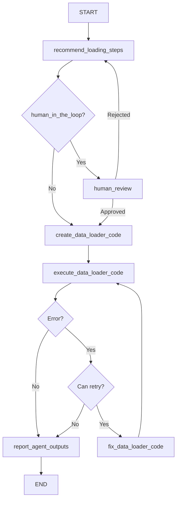

# DataLoaderToolsAgent

## Purpose & Responsibilities

The DataLoaderToolsAgent is responsible for loading data from various sources and formats based on user instructions. It generates Python code to extract, acquire, and load data into pandas DataFrames for further analysis. This agent acts as a gateway for data acquisition in the AI data science ecosystem, enabling access to different data repositories through a unified interface.

The agent can load data from various sources including:
- CSV files (local or remote)
- Excel files
- JSON data
- Databases (SQL, NoSQL)
- APIs
- Web scraping
- Parquet files
- HDFS
- S3 and other cloud storage
- Streaming data sources
- Compressed archives (zip, tar)

## Core Implementation

The DataLoaderToolsAgent extends the BaseAgent class and implements a state graph for data loading:

```python
class DataLoaderToolsAgent(BaseAgent):
    def __init__(
        self, 
        model, 
        n_samples=30, 
        log=False, 
        log_path=None, 
        file_name="data_loader.py", 
        function_name="load_data",
        overwrite=True, 
        human_in_the_loop=False, 
        bypass_recommended_steps=False, 
        bypass_explain_code=False,
        checkpointer=None
    ):
        self._params = {
            "model": model,
            "n_samples": n_samples,
            "log": log,
            "log_path": log_path,
            "file_name": file_name,
            "function_name": function_name,
            "overwrite": overwrite,
            "human_in_the_loop": human_in_the_loop,
            "bypass_recommended_steps": bypass_recommended_steps,
            "bypass_explain_code": bypass_explain_code,
            "checkpointer": checkpointer
        }
        self._compiled_graph = self._make_compiled_graph()
        self.response = None

    def _make_compiled_graph(self):
        self.response = None
        return make_data_loader_tools_agent(**self._params)
```

The agent uses the `make_data_loader_tools_agent` factory function to create a state graph with nodes for:
1. Recommending loading approach
2. Creating data loader code
3. Executing the code
4. Fixing code if errors occur
5. Human review (optional)
6. Reporting outputs

## Input/Output Schema

### Inputs
- **user_instructions** (str): Instructions specifying the data source, format, and any loading parameters
- **source_info** (dict, optional): Additional information about the data source (e.g., credentials, paths)
- **max_retries** (int, default=3): Maximum number of retry attempts for code generation
- **retry_count** (int, default=0): Current retry count

### Outputs
- **loaded_data** (dict): Loaded dataset in dictionary format (convertible to DataFrame)
- **data_loader_function** (str): Generated Python function for data loading
- **data_loader_function_path** (str): Path to the saved function file if logging is enabled
- **data_loader_error** (str): Error message if loading failed
- **messages** (list): List of messages generated during the process
- **recommended_steps** (str): Recommended data loading approach
- **source_metadata** (dict): Metadata about the data source (size, format, schema, etc.)

## State Management

The agent uses a TypedDict to define its state structure:

```python
class GraphState(TypedDict):
    messages: Annotated[Sequence[BaseMessage], operator.add]
    user_instructions: str
    recommended_steps: str
    source_info: dict
    loaded_data: dict
    source_metadata: dict
    data_loader_function: str
    data_loader_function_path: str
    data_loader_file_name: str
    data_loader_function_name: str
    data_loader_error: str
    max_retries: int
    retry_count: int
```

State updates occur in node functions that return partial state updates:

```python
def recommend_loading_steps(state: GraphState):
    # Logic to analyze source and recommend loading approach
    return {
        "recommended_steps": steps_content,
        "messages": [...new messages...]
    }
```

The agent provides accessor methods for retrieving results:
- `get_loaded_data()`
- `get_source_info()`
- `get_data_loader_function()`
- `get_source_metadata()`
- `get_recommended_loading_steps()`

## Dependencies

- **Language Model**: Requires a LangChain-compatible LLM (e.g., ChatOpenAI)
- **pandas**: For data structures and loading
- **requests**: For API and HTTP access
- **sqlalchemy**: For database connections
- **beautifulsoup4**: For web scraping
- **lxml**: For XML parsing
- **pyarrow**: For Parquet files
- **langgraph**: For state graph management
- **IPython.display**: For rendering Markdown output
- **ai_data_science_team.templates**: For agent templates and base implementation
- **ai_data_science_team.parsers.parsers**: For parsing model outputs
- **ai_data_science_team.utils.regex**: For code formatting utilities

## Communication Patterns

The DataLoaderToolsAgent is typically the first agent in a data processing pipeline:

1. As a standalone agent:
   ```python
   response = data_loader_tools_agent.invoke_agent(
       user_instructions="Load the CSV file from https://example.com/data.csv",
       source_info={"api_key": "xxx"}
   )
   loaded_data = data_loader_tools_agent.get_loaded_data()
   ```

2. As an input provider for other agents:
   ```python
   def get_data_for_processing_pipeline(instructions, source_info=None):
       response = data_loader_tools_agent.invoke({
           "user_instructions": instructions,
           "source_info": source_info or {},
           "max_retries": 3
       })
       
       if response.get("data_loader_error"):
           raise ValueError(f"Data loading failed: {response['data_loader_error']}")
           
       return response.get("loaded_data", {})
   ```

## Key Functions & Methods

### Public Methods
- `invoke_agent(user_instructions, source_info=None, max_retries=3, retry_count=0, **kwargs)`: Synchronously loads data
- `ainvoke_agent(user_instructions, source_info=None, max_retries=3, retry_count=0, **kwargs)`: Asynchronously loads data
- `get_workflow_summary(markdown=False)`: Returns a summary of the workflow
- `get_log_summary(markdown=False)`: Returns a summary of the logged operations
- `get_loaded_data()`: Returns the loaded dataset
- `get_source_info()`: Returns information about the data source
- `get_data_loader_function(markdown=False)`: Returns the generated function
- `get_source_metadata()`: Returns metadata about the data source
- `get_recommended_loading_steps(markdown=False)`: Returns the recommended approach

### Internal Node Functions
- `recommend_loading_steps(state)`: Analyzes source and recommends loading steps
- `create_data_loader_code(state)`: Generates Python code for data loading
- `execute_data_loader_code(state)`: Executes the generated code
- `fix_data_loader_code(state)`: Fixes code when errors occur
- `human_review(state)`: Allows human review of the recommendations
- `report_agent_outputs(state)`: Generates a final report

## Configuration Options

- **model**: The language model used for code generation
- **n_samples** (int, default=30): Number of samples to use when summarizing the dataset
- **log** (bool, default=False): Whether to log the generated code and errors
- **log_path** (str, default=None): Directory for storing log files
- **file_name** (str, default="data_loader.py"): Name for the generated code file
- **function_name** (str, default="load_data"): Name of the generated function
- **overwrite** (bool, default=True): Whether to overwrite existing log files
- **human_in_the_loop** (bool, default=False): Enables user review of recommendations
- **bypass_recommended_steps** (bool, default=False): Skips the recommendation step
- **bypass_explain_code** (bool, default=False): Skips code explanation
- **checkpointer** (Checkpointer, default=None): For state persistence

## Execution Flow



## Fetch.ai uAgents Translation Notes

### Protocol Mapping

The DataLoaderToolsAgent's state graph nodes map to uAgent protocols:

```python
from uagents import Agent, Context, Protocol, Message

class DataLoaderProtocol(Protocol):
    # Main processing protocol
    request_schema = {
        "type": "object",
        "properties": {
            "user_instructions": {"type": "string"},
            "source_info": {"type": "object"},
            "max_retries": {"type": "integer"},
            "retry_count": {"type": "integer"}
        },
        "required": ["user_instructions"]
    }
    
    response_schema = {
        "type": "object",
        "properties": {
            "loaded_data": {"type": "object"},
            "data_loader_function": {"type": "string"},
            "data_loader_error": {"type": "string"},
            "recommended_steps": {"type": "string"},
            "source_metadata": {"type": "object"}
        }
    }
```

### Implementation Structure

```python
class DataLoaderToolsUAgent(Agent):
    def __init__(self, model, n_samples=30, log=False, log_path=None, 
                 function_name="load_data", human_in_the_loop=False):
        super().__init__(
            name="data_loader_tools_agent",
            endpoint=["http://localhost:8000/data-loader"]
        )
        self.model = model
        self.n_samples = n_samples
        self.log = log
        self.log_path = log_path
        self.function_name = function_name
        self.human_in_the_loop = human_in_the_loop
        
        # Initialize state
        self.state = DataLoaderState()
        
        # Register protocols
        self.add_protocol(DataLoaderProtocol())
        
    @protocol_handler("load_data")
    async def load_data(self, ctx: Context, sender: str, msg: Message):
        # Extract data from message
        self.state.user_instructions = msg.data["user_instructions"]
        self.state.source_info = msg.data.get("source_info", {})
        self.state.max_retries = msg.data.get("max_retries", 3)
        self.state.retry_count = msg.data.get("retry_count", 0)
        
        # Save initial state
        await self.storage.set("initial_state", self.state.to_dict())
        
        # Start processing workflow
        await self._recommend_loading_steps(ctx, sender)
```

### Protocol Handler Implementation

```python
async def _recommend_loading_steps(self, ctx: Context, sender: str):
    # Generate recommended loading approach using the model
    prompt = self._create_recommendation_prompt(
        self.state.user_instructions,
        self.state.source_info
    )
    steps = await self._generate_from_model(prompt)
    
    # Update state
    self.state.recommended_steps = steps
    
    # Log message
    await self._append_message("Data Loader Tools Agent", 
                              f"I recommend the following data loading steps:\n\n{steps}")
    
    if self.human_in_the_loop:
        # Send message to request human review
        await ctx.send(
            sender,
            Message(
                protocol="human_review",
                performative="request",
                content={
                    "recommended_steps": steps,
                    "source_info": self.state.source_info
                }
            )
        )
    else:
        # Continue to next step
        await self._create_loader_code(ctx, sender)
```

### State Management

```python
class DataLoaderState:
    def __init__(self):
        # Input state
        self.user_instructions = None
        self.source_info = {}
        self.max_retries = 3
        self.retry_count = 0
        
        # Processing state
        self.recommended_steps = None
        self.data_loader_function = None
        self.data_loader_function_path = None
        self.data_loader_file_name = "data_loader.py"
        self.data_loader_function_name = "load_data"
        
        # Output state
        self.loaded_data = None
        self.source_metadata = {}
        self.data_loader_error = None
        self.messages = []
    
    def to_dict(self):
        return {k: v for k, v in vars(self).items() 
                if not k.startswith('_')}
    
    @classmethod
    def from_dict(cls, data):
        state = cls()
        for k, v in data.items():
            if hasattr(state, k):
                setattr(state, k, v)
        return state
```

### Secure Execution Implementation

```python
async def _safe_execute_code(self, function_code):
    """Safely execute the generated code to load data"""
    import pandas as pd
    
    # Create a secure execution environment
    namespace = {
        "pd": pd,
        "requests": __import__("requests"),
        "source_info": self.state.source_info,
        "np": __import__("numpy")
    }
    
    # Add optional libraries if available
    try:
        import sqlalchemy
        namespace["sqlalchemy"] = sqlalchemy
    except ImportError:
        pass
        
    try:
        from bs4 import BeautifulSoup
        namespace["BeautifulSoup"] = BeautifulSoup
    except ImportError:
        pass
    
    # Execute the function code
    exec(function_code, namespace)
    
    # Call the function
    result = namespace[self.state.data_loader_function_name](source_info=self.state.source_info)
    
    # Extract metadata if available
    metadata = {}
    if isinstance(result, tuple) and len(result) == 2:
        data, metadata = result
    else:
        data = result
    
    # Convert result to dict for storage if it's a DataFrame
    if isinstance(data, pd.DataFrame):
        return data.to_dict(), metadata
    return data, metadata
```

### Error Handling with Sanitization

```python
async def _execute_data_loader_code(self, ctx: Context, sender: str):
    try:
        # Execute the generated code
        function_code = self.state.data_loader_function
        
        # Add security checks to prevent malicious code execution
        if self._contains_unsafe_code(function_code):
            raise ValueError("The generated code contains potentially unsafe operations")
        
        # Safe execution in isolated environment
        data, metadata = await self._safe_execute_code(function_code)
        
        # Update state with successful result
        self.state.loaded_data = data
        self.state.source_metadata = metadata
        self.state.data_loader_error = ""
        
        # Send completion message
        await ctx.send(
            sender,
            Message(
                protocol="load_data_response",
                performative="inform",
                content={
                    "loaded_data": self.state.loaded_data,
                    "source_metadata": self.state.source_metadata,
                    "data_loader_function": self.state.data_loader_function,
                    "recommended_steps": self.state.recommended_steps,
                    "data_loader_error": ""
                }
            )
        )
    except Exception as e:
        # Handle error
        self.state.data_loader_error = str(e)
        self.state.retry_count += 1
        
        if self.state.retry_count < self.state.max_retries:
            # Attempt to fix the code
            await self._fix_loader_code(ctx, sender)
        else:
            # Send error response
            await ctx.send(
                sender,
                Message(
                    protocol="load_data_response",
                    performative="inform",
                    content={
                        "data_loader_error": self.state.data_loader_error,
                        "recommended_steps": self.state.recommended_steps,
                        "data_loader_function": self.state.data_loader_function
                    }
                )
            )
```

This translation preserves the core capabilities of the LangGraph-based DataLoaderToolsAgent while adapting to the Fetch.ai uAgents framework, enabling flexible data loading through an agent-based architecture. 