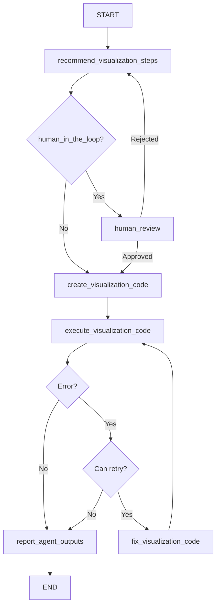

# DataVisualizationAgent

## Purpose & Responsibilities

The DataVisualizationAgent is responsible for creating interactive data visualizations from datasets based on user instructions. It generates Python code using Plotly to create charts, graphs, and dashboards that effectively communicate patterns and insights in the data. This agent can work independently or as part of a multiagent system where it visualizes data processed by other agents.

The agent can create various visualization types including:
- Line charts
- Bar charts
- Scatter plots
- Histograms
- Box plots
- Heatmaps
- Choropleth maps
- 3D visualizations
- Custom interactive dashboards

The agent analyzes the data structure and user instructions to determine the most appropriate visualization type and design elements such as colors, layout, and annotations.

## Core Implementation

The DataVisualizationAgent extends the BaseAgent class and implements a state graph for visualization generation:

```python
class DataVisualizationAgent(BaseAgent):
    def __init__(
        self, 
        model, 
        n_samples=30, 
        log=False, 
        log_path=None, 
        file_name="data_visualization.py", 
        function_name="create_visualization",
        overwrite=True, 
        human_in_the_loop=False, 
        bypass_recommended_steps=False, 
        bypass_explain_code=False,
        checkpointer=None
    ):
        self._params = {
            "model": model,
            "n_samples": n_samples,
            "log": log,
            "log_path": log_path,
            "file_name": file_name,
            "function_name": function_name,
            "overwrite": overwrite,
            "human_in_the_loop": human_in_the_loop,
            "bypass_recommended_steps": bypass_recommended_steps,
            "bypass_explain_code": bypass_explain_code,
            "checkpointer": checkpointer
        }
        self._compiled_graph = self._make_compiled_graph()
        self.response = None

    def _make_compiled_graph(self):
        self.response = None
        return make_data_visualization_agent(**self._params)
```

The agent uses the `make_data_visualization_agent` factory function to create a state graph with nodes for:
1. Recommending visualization approaches
2. Creating visualization code
3. Executing the code
4. Fixing code if errors occur
5. Human review (optional)
6. Reporting outputs

## Input/Output Schema

### Inputs
- **user_instructions** (str): Instructions for the visualization, including chart type, data to highlight, etc.
- **data** (pd.DataFrame or dict): The dataset to visualize
- **max_retries** (int, default=3): Maximum number of retry attempts for code generation
- **retry_count** (int, default=0): Current retry count

### Outputs
- **plotly_graph** (dict): JSON representation of the Plotly graph object
- **data_visualization_function** (str): Generated Python function for creating the visualization
- **data_visualization_function_path** (str): Path to the saved function file if logging is enabled
- **plotly_error** (str): Error message if visualization generation failed
- **messages** (list): List of messages generated during the process
- **recommended_steps** (str): Recommended visualization approach

## State Management

The agent uses a TypedDict to define its state structure:

```python
class GraphState(TypedDict):
    messages: Annotated[Sequence[BaseMessage], operator.add]
    user_instructions: str
    recommended_steps: str
    data: dict
    data_summary: str
    plotly_graph: dict
    data_visualization_function: str
    data_visualization_function_path: str
    data_visualization_file_name: str
    data_visualization_function_name: str
    plotly_error: str
    max_retries: int
    retry_count: int
```

State updates occur in node functions that return partial state updates:

```python
def recommend_visualization_steps(state: GraphState):
    # Logic to analyze data and recommend visualization approach
    return {
        "recommended_steps": steps_content,
        "messages": [...new messages...]
    }
```

The agent provides accessor methods for retrieving results:
- `get_plotly_graph()`
- `get_data_raw()`
- `get_data_visualization_function()`
- `get_recommended_visualization_steps()`
- `show_plotly_graph()`: Renders the visualization in notebooks

## Dependencies

- **Language Model**: Requires a LangChain-compatible LLM (e.g., ChatOpenAI)
- **pandas**: For data manipulation and analysis
- **plotly**: For creating interactive visualizations
- **langgraph**: For state graph management
- **IPython.display**: For rendering visualizations and Markdown
- **ai_data_science_team.templates**: For agent templates and base implementation
- **ai_data_science_team.parsers.parsers**: For parsing model outputs
- **ai_data_science_team.utils.regex**: For code formatting utilities
- **ai_data_science_team.utils.plotly**: For Plotly utilities

## Communication Patterns

The DataVisualizationAgent can operate in two modes:

1. As a standalone agent:
   ```python
   response = data_visualization_agent.invoke_agent(
       user_instructions="Create a scatter plot showing the relationship between sepal length and width",
       data=iris_df
   )
   visualization = data_visualization_agent.get_plotly_graph()
   ```

2. As a component in a multiagent system, where another agent might invoke it:
   ```python
   def invoke_data_visualization_agent(state):
       response = data_visualization_agent.invoke({
           "user_instructions": state["visualization_instructions"],
           "data": state["processed_data"],
           "max_retries": state["max_retries"]
       })
       return {
           "plotly_graph": response.get("plotly_graph", {}),
           "data_visualization_function": response.get("data_visualization_function", "")
       }
   ```

## Key Functions & Methods

### Public Methods
- `invoke_agent(user_instructions, data, max_retries=3, retry_count=0, **kwargs)`: Synchronously creates visualization
- `ainvoke_agent(user_instructions, data, max_retries=3, retry_count=0, **kwargs)`: Asynchronously creates visualization
- `get_workflow_summary(markdown=False)`: Returns a summary of the workflow
- `get_log_summary(markdown=False)`: Returns a summary of the logged operations
- `get_plotly_graph()`: Returns the Plotly graph object
- `show_plotly_graph()`: Displays the visualization
- `get_data_visualization_function(markdown=False)`: Returns the generated function
- `get_recommended_visualization_steps(markdown=False)`: Returns the recommended approach

### Internal Node Functions
- `recommend_visualization_steps(state)`: Analyzes data and recommends visualization approach
- `create_visualization_code(state)`: Generates Python code for visualization
- `execute_visualization_code(state)`: Executes the generated code
- `fix_visualization_code(state)`: Fixes code when errors occur
- `human_review(state)`: Allows human review of the recommendations
- `report_agent_outputs(state)`: Generates a final report

## Configuration Options

- **model**: The language model used for code generation
- **n_samples** (int, default=30): Number of samples to use when summarizing the dataset
- **log** (bool, default=False): Whether to log the generated code and errors
- **log_path** (str, default=None): Directory for storing log files
- **file_name** (str, default="data_visualization.py"): Name for the generated code file
- **function_name** (str, default="create_visualization"): Name of the generated function
- **overwrite** (bool, default=True): Whether to overwrite existing log files
- **human_in_the_loop** (bool, default=False): Enables user review of recommendations
- **bypass_recommended_steps** (bool, default=False): Skips the recommendation step
- **bypass_explain_code** (bool, default=False): Skips code explanation
- **checkpointer** (Checkpointer, default=None): For state persistence

## Execution Flow



## Fetch.ai uAgents Translation Notes

### Protocol Mapping

The DataVisualizationAgent's state graph nodes map to uAgent protocols:

```python
from uagents import Agent, Context, Protocol, Message

class DataVisualizationProtocol(Protocol):
    # Main processing protocol
    request_schema = {
        "type": "object",
        "properties": {
            "user_instructions": {"type": "string"},
            "data": {"type": "object"},
            "max_retries": {"type": "integer"},
            "retry_count": {"type": "integer"}
        },
        "required": ["user_instructions", "data"]
    }
    
    response_schema = {
        "type": "object",
        "properties": {
            "plotly_graph": {"type": "object"},
            "data_visualization_function": {"type": "string"},
            "plotly_error": {"type": "string"},
            "recommended_steps": {"type": "string"}
        }
    }
```

### Implementation Structure

```python
class DataVisualizationUAgent(Agent):
    def __init__(self, model, n_samples=30, log=False, log_path=None, 
                 function_name="create_visualization", human_in_the_loop=False):
        super().__init__(
            name="data_visualization_agent",
            endpoint=["http://localhost:8000/data-visualization"]
        )
        self.model = model
        self.n_samples = n_samples
        self.log = log
        self.log_path = log_path
        self.function_name = function_name
        self.human_in_the_loop = human_in_the_loop
        
        # Initialize state
        self.state = DataVisualizationState()
        
        # Register protocols
        self.add_protocol(DataVisualizationProtocol())
        
    @protocol_handler("create_visualization")
    async def create_visualization(self, ctx: Context, sender: str, msg: Message):
        # Extract data from message
        self.state.user_instructions = msg.data["user_instructions"]
        self.state.data = msg.data["data"]
        self.state.max_retries = msg.data.get("max_retries", 3)
        self.state.retry_count = msg.data.get("retry_count", 0)
        
        # Save initial state
        await self.storage.set("initial_state", self.state.to_dict())
        
        # Start processing workflow
        await self._recommend_visualization_steps(ctx, sender)
```

### Protocol Handler Implementation

```python
async def _recommend_visualization_steps(self, ctx: Context, sender: str):
    # Generate data summary
    data_summary = self._generate_data_summary(self.state.data)
    
    # Generate recommended visualization approach using the model
    prompt = self._create_recommendation_prompt(
        data_summary, self.state.user_instructions
    )
    steps = await self._generate_from_model(prompt)
    
    # Update state
    self.state.recommended_steps = steps
    self.state.data_summary = data_summary
    
    # Log message
    await self._append_message("Data Visualization Agent", 
                              f"I recommend the following visualization approach:\n\n{steps}")
    
    if self.human_in_the_loop:
        # Send message to request human review
        await ctx.send(
            sender,
            Message(
                protocol="human_review",
                performative="request",
                content={
                    "recommended_steps": steps,
                    "data_summary": data_summary
                }
            )
        )
    else:
        # Continue to next step
        await self._create_visualization_code(ctx, sender)
```

### State Management

```python
class DataVisualizationState:
    def __init__(self):
        # Input state
        self.user_instructions = None
        self.data = None
        self.max_retries = 3
        self.retry_count = 0
        
        # Processing state
        self.data_summary = None
        self.recommended_steps = None
        self.data_visualization_function = None
        self.data_visualization_function_path = None
        self.data_visualization_file_name = "data_visualization.py"
        self.data_visualization_function_name = "create_visualization"
        
        # Output state
        self.plotly_graph = None
        self.plotly_error = None
        self.messages = []
    
    def to_dict(self):
        return {k: v for k, v in vars(self).items() 
                if not k.startswith('_')}
    
    @classmethod
    def from_dict(cls, data):
        state = cls()
        for k, v in data.items():
            if hasattr(state, k):
                setattr(state, k, v)
        return state
```

### Error Handling

```python
async def _execute_visualization_code(self, ctx: Context, sender: str):
    try:
        # Execute the generated code
        function_code = self.state.data_visualization_function
        
        # Safe execution in isolated environment
        plotly_graph = await self._safe_execute_code(function_code, self.state.data)
        
        # Update state with successful result
        self.state.plotly_graph = plotly_graph
        self.state.plotly_error = ""
        
        # Send completion message
        await ctx.send(
            sender,
            Message(
                protocol="create_visualization_response",
                performative="inform",
                content={
                    "plotly_graph": self.state.plotly_graph,
                    "data_visualization_function": self.state.data_visualization_function,
                    "recommended_steps": self.state.recommended_steps,
                    "plotly_error": ""
                }
            )
        )
    except Exception as e:
        # Handle error
        self.state.plotly_error = str(e)
        self.state.retry_count += 1
        
        if self.state.retry_count < self.state.max_retries:
            # Attempt to fix the code
            await self._fix_visualization_code(ctx, sender)
        else:
            # Send error response
            await ctx.send(
                sender,
                Message(
                    protocol="create_visualization_response",
                    performative="inform",
                    content={
                        "plotly_error": self.state.plotly_error,
                        "recommended_steps": self.state.recommended_steps,
                        "data_visualization_function": self.state.data_visualization_function
                    }
                )
            )
```

### Visualization Display Helper

```python
@protocol_handler("display_visualization")
async def display_visualization(self, ctx: Context, sender: str, msg: Message):
    if not self.state.plotly_graph:
        await ctx.send(
            sender,
            Message(
                protocol="display_visualization_response",
                performative="inform",
                content={
                    "error": "No visualization available. Please create one first."
                }
            )
        )
        return
        
    # Convert plotly graph to HTML
    html_content = self._plotly_to_html(self.state.plotly_graph)
    
    # Send HTML content for display
    await ctx.send(
        sender,
        Message(
            protocol="display_visualization_response",
            performative="inform",
            content={
                "html_content": html_content,
                "visualization_title": self._extract_title(self.state.plotly_graph)
            }
        )
    )
```

This translation preserves the core capabilities of the LangGraph-based DataVisualizationAgent while adapting to the Fetch.ai uAgents framework, enabling interactive visualization creation through an agent-based architecture. 