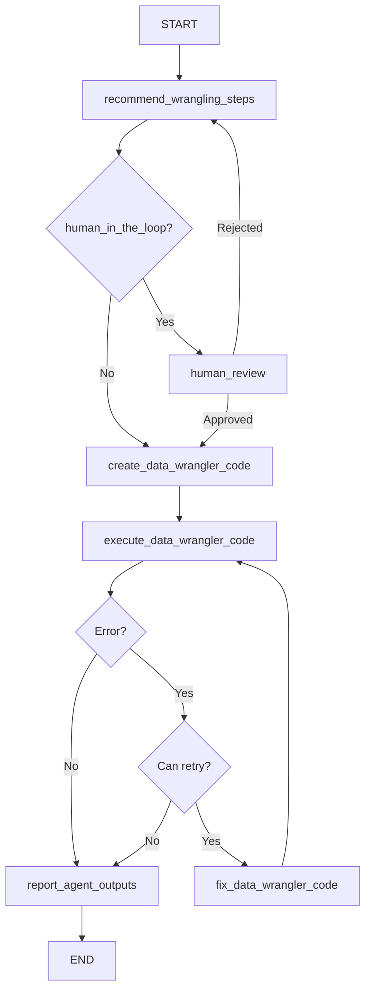

# DataWranglingAgent

## Purpose & Responsibilities

The DataWranglingAgent is responsible for transforming and manipulating data based on user instructions. It generates Python code using pandas to reshape, filter, aggregate, merge, and prepare data for analysis or visualization. This agent can work both independently for data transformation tasks and as part of a multiagent system where it prepares data for other agents to analyze or visualize.

The agent can perform various data wrangling operations including:
- Reshaping data (wide to long, long to wide)
- Filtering rows based on conditions
- Selecting and renaming columns
- Handling missing values
- Aggregating data
- Creating new calculated columns
- Merging or joining multiple datasets
- Applying complex transformations
- Converting data types
- Time series manipulations
- Grouping and summarizing data

## Core Implementation

The DataWranglingAgent extends the BaseAgent class and implements a state graph for data wrangling:

```python
class DataWranglingAgent(BaseAgent):
    def __init__(
        self, 
        model, 
        n_samples=30, 
        log=False, 
        log_path=None, 
        file_name="data_wrangler.py", 
        function_name="wrangle_data",
        overwrite=True, 
        human_in_the_loop=False, 
        bypass_recommended_steps=False, 
        bypass_explain_code=False,
        checkpointer=None
    ):
        self._params = {
            "model": model,
            "n_samples": n_samples,
            "log": log,
            "log_path": log_path,
            "file_name": file_name,
            "function_name": function_name,
            "overwrite": overwrite,
            "human_in_the_loop": human_in_the_loop,
            "bypass_recommended_steps": bypass_recommended_steps,
            "bypass_explain_code": bypass_explain_code,
            "checkpointer": checkpointer
        }
        self._compiled_graph = self._make_compiled_graph()
        self.response = None

    def _make_compiled_graph(self):
        self.response = None
        return make_data_wrangling_agent(**self._params)
```

The agent uses the `make_data_wrangling_agent` factory function to create a state graph with nodes for:
1. Recommending wrangling steps
2. Creating wrangling code
3. Executing the code
4. Fixing code if errors occur
5. Human review (optional)
6. Reporting outputs

## Input/Output Schema

### Inputs
- **user_instructions** (str): Instructions for data wrangling, including operations to perform
- **data_raw** (pd.DataFrame or dict): The dataset(s) to wrangle
- **max_retries** (int, default=3): Maximum number of retry attempts for code generation
- **retry_count** (int, default=0): Current retry count

### Outputs
- **data_wrangled** (dict): Wrangled dataset in dictionary format (convertible to DataFrame)
- **data_wrangler_function** (str): Generated Python function for data wrangling
- **data_wrangler_function_path** (str): Path to the saved function file if logging is enabled
- **data_wrangler_error** (str): Error message if wrangling failed
- **messages** (list): List of messages generated during the process
- **recommended_steps** (str): Recommended wrangling steps

## State Management

The agent uses a TypedDict to define its state structure:

```python
class GraphState(TypedDict):
    messages: Annotated[Sequence[BaseMessage], operator.add]
    user_instructions: str
    recommended_steps: str
    data_raw: dict
    data_wrangled: dict
    all_datasets_summary: str
    data_wrangler_function: str
    data_wrangler_function_path: str
    data_wrangler_file_name: str
    data_wrangler_function_name: str
    data_wrangler_error: str
    max_retries: int
    retry_count: int
```

State updates occur in node functions that return partial state updates:

```python
def recommend_wrangling_steps(state: GraphState):
    # Logic to analyze data and recommend wrangling approach
    return {
        "recommended_steps": steps_content,
        "messages": [...new messages...]
    }
```

The agent provides accessor methods for retrieving results:
- `get_data_wrangled()`
- `get_data_raw()`
- `get_data_wrangler_function()`
- `get_recommended_wrangling_steps()`

## Dependencies

- **Language Model**: Requires a LangChain-compatible LLM (e.g., ChatOpenAI)
- **pandas**: For data manipulation and transformation
- **numpy**: For numerical operations
- **langgraph**: For state graph management
- **IPython.display**: For rendering Markdown output
- **ai_data_science_team.templates**: For agent templates and base implementation
- **ai_data_science_team.parsers.parsers**: For parsing model outputs
- **ai_data_science_team.utils.regex**: For code formatting utilities
- **ai_data_science_team.tools.dataframe**: For dataframe summarization

## Communication Patterns

The DataWranglingAgent can operate in two modes:

1. As a standalone agent:
   ```python
   response = data_wrangling_agent.invoke_agent(
       user_instructions="Reshape the data from wide to long format, keeping the ID column as an identifier",
       data_raw=df
   )
   wrangled_data = data_wrangling_agent.get_data_wrangled()
   ```

2. As a component in a multiagent system, frequently paired with visualization or analysis agents:
   ```python
   def invoke_data_wrangling_agent(state):
       response = data_wrangling_agent.invoke({
           "user_instructions": state["wrangling_instructions"],
           "data_raw": state["data_raw"],
           "max_retries": state["max_retries"]
       })
       return {
           "data_wrangled": response.get("data_wrangled", {}),
           "data_wrangler_function": response.get("data_wrangler_function", "")
       }
   ```

## Key Functions & Methods

### Public Methods
- `invoke_agent(user_instructions, data_raw, max_retries=3, retry_count=0, **kwargs)`: Synchronously wrangles data
- `ainvoke_agent(user_instructions, data_raw, max_retries=3, retry_count=0, **kwargs)`: Asynchronously wrangles data
- `get_workflow_summary(markdown=False)`: Returns a summary of the workflow
- `get_log_summary(markdown=False)`: Returns a summary of the logged operations
- `get_data_wrangled()`: Returns the wrangled dataset
- `get_data_raw()`: Returns the original dataset
- `get_data_wrangler_function(markdown=False)`: Returns the generated function
- `get_recommended_wrangling_steps(markdown=False)`: Returns the recommended steps

### Internal Node Functions
- `recommend_wrangling_steps(state)`: Analyzes data and recommends wrangling steps
- `create_data_wrangler_code(state)`: Generates Python code for data wrangling
- `execute_data_wrangler_code(state)`: Executes the generated code
- `fix_data_wrangler_code(state)`: Fixes code when errors occur
- `human_review(state)`: Allows human review of the recommendations
- `report_agent_outputs(state)`: Generates a final report

## Configuration Options

- **model**: The language model used for code generation
- **n_samples** (int, default=30): Number of samples to use when summarizing the dataset
- **log** (bool, default=False): Whether to log the generated code and errors
- **log_path** (str, default=None): Directory for storing log files
- **file_name** (str, default="data_wrangler.py"): Name for the generated code file
- **function_name** (str, default="wrangle_data"): Name of the generated function
- **overwrite** (bool, default=True): Whether to overwrite existing log files
- **human_in_the_loop** (bool, default=False): Enables user review of recommendations
- **bypass_recommended_steps** (bool, default=False): Skips the recommendation step
- **bypass_explain_code** (bool, default=False): Skips code explanation
- **checkpointer** (Checkpointer, default=None): For state persistence

## Execution Flow



## Fetch.ai uAgents Translation Notes

### Protocol Mapping

The DataWranglingAgent's state graph nodes map to uAgent protocols:

```python
from uagents import Agent, Context, Protocol, Message

class DataWranglingProtocol(Protocol):
    # Main processing protocol
    request_schema = {
        "type": "object",
        "properties": {
            "user_instructions": {"type": "string"},
            "data_raw": {"type": "object"},
            "max_retries": {"type": "integer"},
            "retry_count": {"type": "integer"}
        },
        "required": ["user_instructions", "data_raw"]
    }
    
    response_schema = {
        "type": "object",
        "properties": {
            "data_wrangled": {"type": "object"},
            "data_wrangler_function": {"type": "string"},
            "data_wrangler_error": {"type": "string"},
            "recommended_steps": {"type": "string"}
        }
    }
```

### Implementation Structure

```python
class DataWranglingUAgent(Agent):
    def __init__(self, model, n_samples=30, log=False, log_path=None, 
                 function_name="wrangle_data", human_in_the_loop=False):
        super().__init__(
            name="data_wrangling_agent",
            endpoint=["http://localhost:8000/data-wrangling"]
        )
        self.model = model
        self.n_samples = n_samples
        self.log = log
        self.log_path = log_path
        self.function_name = function_name
        self.human_in_the_loop = human_in_the_loop
        
        # Initialize state
        self.state = DataWranglingState()
        
        # Register protocols
        self.add_protocol(DataWranglingProtocol())
        
    @protocol_handler("wrangle_data")
    async def wrangle_data(self, ctx: Context, sender: str, msg: Message):
        # Extract data from message
        self.state.user_instructions = msg.data["user_instructions"]
        
        # Handle both DataFrame (converted to dict) and direct dict inputs
        data_raw = msg.data["data_raw"]
        self.state.data_raw = data_raw
        
        self.state.max_retries = msg.data.get("max_retries", 3)
        self.state.retry_count = msg.data.get("retry_count", 0)
        
        # Save initial state
        await self.storage.set("initial_state", self.state.to_dict())
        
        # Start processing workflow
        await self._recommend_wrangling_steps(ctx, sender)
```

### Protocol Handler Implementation

```python
async def _recommend_wrangling_steps(self, ctx: Context, sender: str):
    # Generate data summary
    data_summary = self._generate_data_summary(self.state.data_raw)
    
    # Generate recommended wrangling approach using the model
    prompt = self._create_recommendation_prompt(
        data_summary, self.state.user_instructions
    )
    steps = await self._generate_from_model(prompt)
    
    # Update state
    self.state.recommended_steps = steps
    self.state.all_datasets_summary = data_summary
    
    # Log message
    await self._append_message("Data Wrangling Agent", 
                              f"I recommend the following wrangling steps:\n\n{steps}")
    
    if self.human_in_the_loop:
        # Send message to request human review
        await ctx.send(
            sender,
            Message(
                protocol="human_review",
                performative="request",
                content={
                    "recommended_steps": steps,
                    "data_summary": data_summary
                }
            )
        )
    else:
        # Continue to next step
        await self._create_wrangler_code(ctx, sender)
```

### State Management

```python
class DataWranglingState:
    def __init__(self):
        # Input state
        self.user_instructions = None
        self.data_raw = None
        self.max_retries = 3
        self.retry_count = 0
        
        # Processing state
        self.all_datasets_summary = None
        self.recommended_steps = None
        self.data_wrangler_function = None
        self.data_wrangler_function_path = None
        self.data_wrangler_file_name = "data_wrangler.py"
        self.data_wrangler_function_name = "wrangle_data"
        
        # Output state
        self.data_wrangled = None
        self.data_wrangler_error = None
        self.messages = []
    
    def to_dict(self):
        return {k: v for k, v in vars(self).items() 
                if not k.startswith('_')}
    
    @classmethod
    def from_dict(cls, data):
        state = cls()
        for k, v in data.items():
            if hasattr(state, k):
                setattr(state, k, v)
        return state
```

### Multi-Dataset Handling

```python
async def _safe_execute_code(self, function_code, data_raw):
    """Safely execute the generated code with the input data"""
    import pandas as pd
    
    # Create a secure execution environment
    namespace = {
        "pd": pd,
        "np": __import__("numpy"),
        "data_raw": None
    }
    
    # If data_raw is a dictionary of DataFrames/dicts
    if isinstance(data_raw, dict) and all(isinstance(v, (dict, pd.DataFrame)) for v in data_raw.values()):
        # Convert any DataFrames to dicts for serialization
        processed_data = {}
        for k, v in data_raw.items():
            if isinstance(v, pd.DataFrame):
                processed_data[k] = v
            else:
                processed_data[k] = pd.DataFrame(v)
        namespace["data_raw"] = processed_data
    else:
        # Single DataFrame case
        if isinstance(data_raw, dict) and not any(isinstance(v, (dict, pd.DataFrame)) for v in data_raw.values()):
            namespace["data_raw"] = pd.DataFrame(data_raw)
        else:
            namespace["data_raw"] = data_raw
    
    # Execute the function code
    exec(function_code, namespace)
    
    # Call the function
    result = namespace[self.state.data_wrangler_function_name](namespace["data_raw"])
    
    # Convert result to dict for storage if it's a DataFrame
    if isinstance(result, pd.DataFrame):
        return result.to_dict()
    return result
```

### Error Handling

```python
async def _fix_wrangler_code(self, ctx: Context, sender: str):
    try:
        # Generate fix for the code
        prompt = self._create_fix_code_prompt(
            self.state.data_wrangler_function,
            self.state.data_wrangler_error
        )
        fixed_code = await self._generate_from_model(prompt)
        
        # Update state with fixed code
        self.state.data_wrangler_function = fixed_code
        
        # Log the fix attempt
        await self._append_message("Data Wrangling Agent", 
                                  f"I've fixed the code. Attempting to execute again.")
        
        # Try executing the fixed code
        await self._execute_wrangler_code(ctx, sender)
    except Exception as e:
        # If fixing itself fails, increment retry count and potentially give up
        self.state.data_wrangler_error = f"Error fixing code: {str(e)}"
        self.state.retry_count += 1
        
        if self.state.retry_count < self.state.max_retries:
            await self._fix_wrangler_code(ctx, sender)
        else:
            # Send error response after max retries
            await ctx.send(
                sender,
                Message(
                    protocol="wrangle_data_response",
                    performative="inform",
                    content={
                        "data_wrangler_error": self.state.data_wrangler_error,
                        "recommended_steps": self.state.recommended_steps,
                        "data_wrangler_function": self.state.data_wrangler_function
                    }
                )
            )
```

This translation preserves the core capabilities of the LangGraph-based DataWranglingAgent while adapting to the Fetch.ai uAgents framework, enabling powerful data transformation through an agent-based architecture. 