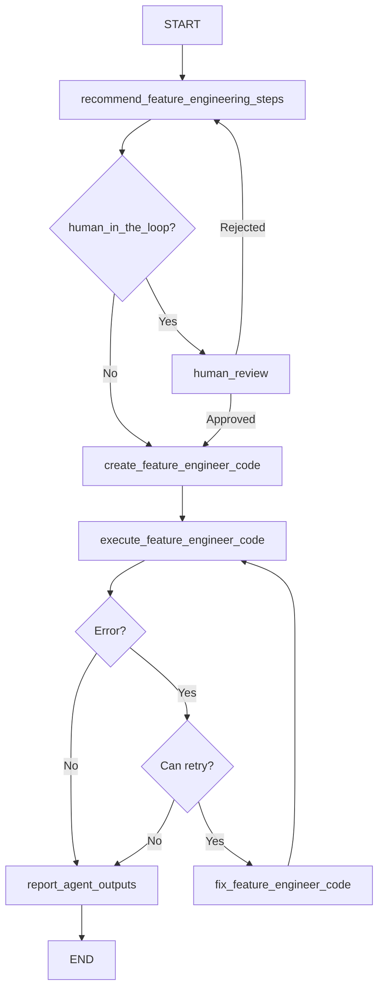

# FeatureEngineeringAgent

## Purpose & Responsibilities

The FeatureEngineeringAgent is specialized for creating and transforming features for machine learning tasks based on user instructions. It generates Python code to manipulate, transform, and create new features that can improve model performance. The agent analyzes data characteristics to recommend appropriate feature engineering techniques and implements them through code generation.

The agent can perform various feature engineering operations including:
- Creating polynomial features
- One-hot encoding categorical variables
- Ordinal encoding
- Binning continuous variables
- Feature scaling (normalization, standardization)
- Feature selection
- Handling missing values
- Generating time-based features from dates
- Creating interaction terms
- Extracting text features
- Dimensionality reduction
- Target encoding
- Feature aggregation
- Signal processing transformations

## Core Implementation

The FeatureEngineeringAgent extends the BaseAgent class and implements a state graph for feature engineering:

```python
class FeatureEngineeringAgent(BaseAgent):
    def __init__(
        self, 
        model, 
        n_samples=30, 
        log=False, 
        log_path=None, 
        file_name="feature_engineer.py", 
        function_name="engineer_features",
        overwrite=True, 
        human_in_the_loop=False, 
        bypass_recommended_steps=False, 
        bypass_explain_code=False,
        checkpointer=None
    ):
        self._params = {
            "model": model,
            "n_samples": n_samples,
            "log": log,
            "log_path": log_path,
            "file_name": file_name,
            "function_name": function_name,
            "overwrite": overwrite,
            "human_in_the_loop": human_in_the_loop,
            "bypass_recommended_steps": bypass_recommended_steps,
            "bypass_explain_code": bypass_explain_code,
            "checkpointer": checkpointer
        }
        self._compiled_graph = self._make_compiled_graph()
        self.response = None

    def _make_compiled_graph(self):
        self.response = None
        return make_feature_engineering_agent(**self._params)
```

The agent uses the `make_feature_engineering_agent` factory function to create a state graph with nodes for:
1. Recommending feature engineering steps
2. Creating feature engineering code
3. Executing the code
4. Fixing code if errors occur
5. Human review (optional)
6. Reporting outputs

## Input/Output Schema

### Inputs
- **user_instructions** (str): Instructions for feature engineering, specifying target variable, feature creation goals, etc.
- **data_raw** (pd.DataFrame or dict): The dataset to engineer features for
- **max_retries** (int, default=3): Maximum number of retry attempts for code generation
- **retry_count** (int, default=0): Current retry count

### Outputs
- **data_features** (dict): Engineered features dataset in dictionary format (convertible to DataFrame)
- **feature_engineer_function** (str): Generated Python function for feature engineering
- **feature_engineer_function_path** (str): Path to the saved function file if logging is enabled
- **feature_engineer_error** (str): Error message if feature engineering failed
- **messages** (list): List of messages generated during the process
- **recommended_steps** (str): Recommended feature engineering approach

## State Management

The agent uses a TypedDict to define its state structure:

```python
class GraphState(TypedDict):
    messages: Annotated[Sequence[BaseMessage], operator.add]
    user_instructions: str
    recommended_steps: str
    data_raw: dict
    data_features: dict
    all_datasets_summary: str
    feature_engineer_function: str
    feature_engineer_function_path: str
    feature_engineer_file_name: str
    feature_engineer_function_name: str
    feature_engineer_error: str
    max_retries: int
    retry_count: int
```

State updates occur in node functions that return partial state updates:

```python
def recommend_feature_engineering_steps(state: GraphState):
    # Logic to analyze data and recommend feature engineering approach
    return {
        "recommended_steps": steps_content,
        "messages": [...new messages...]
    }
```

The agent provides accessor methods for retrieving results:
- `get_data_features()`
- `get_data_raw()`
- `get_feature_engineer_function()`
- `get_recommended_feature_engineering_steps()`

## Dependencies

- **Language Model**: Requires a LangChain-compatible LLM (e.g., ChatOpenAI)
- **pandas**: For data manipulation
- **numpy**: For numerical operations
- **scikit-learn**: For feature engineering utilities
- **category_encoders**: For advanced encoding techniques
- **langgraph**: For state graph management
- **IPython.display**: For rendering Markdown output
- **ai_data_science_team.templates**: For agent templates and base implementation
- **ai_data_science_team.parsers.parsers**: For parsing model outputs
- **ai_data_science_team.utils.regex**: For code formatting utilities
- **ai_data_science_team.tools.dataframe**: For dataframe summarization

## Communication Patterns

The FeatureEngineeringAgent is an independent agent that can operate in two modes:

1. As a standalone agent:
   ```python
   response = feature_engineering_agent.invoke_agent(
       user_instructions="Create polynomial features for numerical columns and one-hot encode categorical variables",
       data_raw=df
   )
   engineered_data = feature_engineering_agent.get_data_features()
   ```

2. As a component in a machine learning pipeline:
   ```python
   def invoke_feature_engineering_agent(state):
       response = feature_engineering_agent.invoke({
           "user_instructions": state["feature_engineering_instructions"],
           "data_raw": state["preprocessed_data"],
           "max_retries": state["max_retries"]
       })
       return {
           "data_features": response.get("data_features", {}),
           "feature_engineer_function": response.get("feature_engineer_function", "")
       }
   ```

## Key Functions & Methods

### Public Methods
- `invoke_agent(user_instructions, data_raw, max_retries=3, retry_count=0, **kwargs)`: Synchronously engineers features
- `ainvoke_agent(user_instructions, data_raw, max_retries=3, retry_count=0, **kwargs)`: Asynchronously engineers features
- `get_workflow_summary(markdown=False)`: Returns a summary of the workflow
- `get_log_summary(markdown=False)`: Returns a summary of the logged operations
- `get_data_features()`: Returns the engineered features dataset
- `get_data_raw()`: Returns the original dataset
- `get_feature_engineer_function(markdown=False)`: Returns the generated function
- `get_recommended_feature_engineering_steps(markdown=False)`: Returns the recommended steps

### Internal Node Functions
- `recommend_feature_engineering_steps(state)`: Analyzes data and recommends feature engineering
- `create_feature_engineer_code(state)`: Generates Python code for feature engineering
- `execute_feature_engineer_code(state)`: Executes the generated code
- `fix_feature_engineer_code(state)`: Fixes code when errors occur
- `human_review(state)`: Allows human review of the recommendations
- `report_agent_outputs(state)`: Generates a final report

## Configuration Options

- **model**: The language model used for code generation
- **n_samples** (int, default=30): Number of samples to use when summarizing the dataset
- **log** (bool, default=False): Whether to log the generated code and errors
- **log_path** (str, default=None): Directory for storing log files
- **file_name** (str, default="feature_engineer.py"): Name for the generated code file
- **function_name** (str, default="engineer_features"): Name of the generated function
- **overwrite** (bool, default=True): Whether to overwrite existing log files
- **human_in_the_loop** (bool, default=False): Enables user review of recommendations
- **bypass_recommended_steps** (bool, default=False): Skips the recommendation step
- **bypass_explain_code** (bool, default=False): Skips code explanation
- **checkpointer** (Checkpointer, default=None): For state persistence

## Execution Flow



## Fetch.ai uAgents Translation Notes

### Protocol Mapping

The FeatureEngineeringAgent's state graph nodes map to uAgent protocols:

```python
from uagents import Agent, Context, Protocol, Message

class FeatureEngineeringProtocol(Protocol):
    # Main processing protocol
    request_schema = {
        "type": "object",
        "properties": {
            "user_instructions": {"type": "string"},
            "data_raw": {"type": "object"},
            "max_retries": {"type": "integer"},
            "retry_count": {"type": "integer"}
        },
        "required": ["user_instructions", "data_raw"]
    }
    
    response_schema = {
        "type": "object",
        "properties": {
            "data_features": {"type": "object"},
            "feature_engineer_function": {"type": "string"},
            "feature_engineer_error": {"type": "string"},
            "recommended_steps": {"type": "string"}
        }
    }
```

### Implementation Structure

```python
class FeatureEngineeringUAgent(Agent):
    def __init__(self, model, n_samples=30, log=False, log_path=None, 
                 function_name="engineer_features", human_in_the_loop=False):
        super().__init__(
            name="feature_engineering_agent",
            endpoint=["http://localhost:8000/feature-engineering"]
        )
        self.model = model
        self.n_samples = n_samples
        self.log = log
        self.log_path = log_path
        self.function_name = function_name
        self.human_in_the_loop = human_in_the_loop
        
        # Initialize state
        self.state = FeatureEngineeringState()
        
        # Register protocols
        self.add_protocol(FeatureEngineeringProtocol())
        
    @protocol_handler("engineer_features")
    async def engineer_features(self, ctx: Context, sender: str, msg: Message):
        # Extract data from message
        self.state.user_instructions = msg.data["user_instructions"]
        
        # Handle both DataFrame (converted to dict) and direct dict inputs
        data_raw = msg.data["data_raw"]
        self.state.data_raw = data_raw
        
        self.state.max_retries = msg.data.get("max_retries", 3)
        self.state.retry_count = msg.data.get("retry_count", 0)
        
        # Save initial state
        await self.storage.set("initial_state", self.state.to_dict())
        
        # Start processing workflow
        await self._recommend_feature_engineering_steps(ctx, sender)
```

### Protocol Handler Implementation

```python
async def _recommend_feature_engineering_steps(self, ctx: Context, sender: str):
    # Generate data summary
    data_summary = self._generate_data_summary(self.state.data_raw)
    
    # Generate recommended feature engineering approach using the model
    prompt = self._create_recommendation_prompt(
        data_summary, self.state.user_instructions
    )
    steps = await self._generate_from_model(prompt)
    
    # Update state
    self.state.recommended_steps = steps
    self.state.all_datasets_summary = data_summary
    
    # Log message
    await self._append_message("Feature Engineering Agent", 
                              f"I recommend the following feature engineering steps:\n\n{steps}")
    
    if self.human_in_the_loop:
        # Send message to request human review
        await ctx.send(
            sender,
            Message(
                protocol="human_review",
                performative="request",
                content={
                    "recommended_steps": steps,
                    "data_summary": data_summary
                }
            )
        )
    else:
        # Continue to next step
        await self._create_feature_engineer_code(ctx, sender)
```

### State Management

```python
class FeatureEngineeringState:
    def __init__(self):
        # Input state
        self.user_instructions = None
        self.data_raw = None
        self.max_retries = 3
        self.retry_count = 0
        
        # Processing state
        self.all_datasets_summary = None
        self.recommended_steps = None
        self.feature_engineer_function = None
        self.feature_engineer_function_path = None
        self.feature_engineer_file_name = "feature_engineer.py"
        self.feature_engineer_function_name = "engineer_features"
        
        # Output state
        self.data_features = None
        self.feature_engineer_error = None
        self.messages = []
    
    def to_dict(self):
        return {k: v for k, v in vars(self).items() 
                if not k.startswith('_')}
    
    @classmethod
    def from_dict(cls, data):
        state = cls()
        for k, v in data.items():
            if hasattr(state, k):
                setattr(state, k, v)
        return state
```

### Safe Execution Implementation

```python
async def _safe_execute_code(self, function_code, data_raw):
    """Safely execute the generated code with the input data"""
    import pandas as pd
    
    # Create a secure execution environment with common feature engineering libraries
    namespace = {
        "pd": pd,
        "np": __import__("numpy"),
        "data_raw": None
    }
    
    # Add scikit-learn components commonly used in feature engineering
    try:
        from sklearn.preprocessing import StandardScaler, MinMaxScaler, OneHotEncoder, PolynomialFeatures
        from sklearn.feature_selection import SelectKBest, f_classif, f_regression
        from sklearn.decomposition import PCA
        
        namespace.update({
            "StandardScaler": StandardScaler,
            "MinMaxScaler": MinMaxScaler,
            "OneHotEncoder": OneHotEncoder,
            "PolynomialFeatures": PolynomialFeatures,
            "SelectKBest": SelectKBest,
            "f_classif": f_classif,
            "f_regression": f_regression,
            "PCA": PCA
        })
    except ImportError:
        # Continue even if scikit-learn is not available
        pass
    
    # Try to add category_encoders if available
    try:
        import category_encoders as ce
        namespace["ce"] = ce
    except ImportError:
        # Continue even if category_encoders is not available
        pass
    
    # Convert input to DataFrame if it's a dict
    if isinstance(data_raw, dict) and not any(isinstance(v, (dict, pd.DataFrame)) for v in data_raw.values()):
        namespace["data_raw"] = pd.DataFrame(data_raw)
    else:
        namespace["data_raw"] = data_raw
    
    # Execute the function code
    exec(function_code, namespace)
    
    # Call the function
    result = namespace[self.state.feature_engineer_function_name](namespace["data_raw"])
    
    # Convert result to dict for storage if it's a DataFrame
    if isinstance(result, pd.DataFrame):
        return result.to_dict()
    return result
```

### Cross-Validation Handling

```python
async def _execute_feature_engineer_code(self, ctx: Context, sender: str):
    try:
        # Execute the generated code
        function_code = self.state.feature_engineer_function
        
        # Safe execution in isolated environment
        result = await self._safe_execute_code(function_code, self.state.data_raw)
        
        # Check if result contains train/test/validation split
        if isinstance(result, dict) and any(k in result for k in ["train", "test", "valid", "validation"]):
            # Handle case where feature engineering returns multiple datasets
            processed_result = {}
            for k, v in result.items():
                if isinstance(v, pd.DataFrame):
                    processed_result[k] = v.to_dict()
                else:
                    processed_result[k] = v
            
            # Update state with successful result
            self.state.data_features = processed_result
        else:
            # Single dataset result
            self.state.data_features = result
            
        self.state.feature_engineer_error = ""
        
        # Send completion message
        await ctx.send(
            sender,
            Message(
                protocol="engineer_features_response",
                performative="inform",
                content={
                    "data_features": self.state.data_features,
                    "feature_engineer_function": self.state.feature_engineer_function,
                    "recommended_steps": self.state.recommended_steps,
                    "feature_engineer_error": ""
                }
            )
        )
    except Exception as e:
        # Handle error
        self.state.feature_engineer_error = str(e)
        self.state.retry_count += 1
        
        if self.state.retry_count < self.state.max_retries:
            # Attempt to fix the code
            await self._fix_feature_engineer_code(ctx, sender)
        else:
            # Send error response
            await ctx.send(
                sender,
                Message(
                    protocol="engineer_features_response",
                    performative="inform",
                    content={
                        "feature_engineer_error": self.state.feature_engineer_error,
                        "recommended_steps": self.state.recommended_steps,
                        "feature_engineer_function": self.state.feature_engineer_function
                    }
                )
            )
```

This translation preserves the core capabilities of the LangGraph-based FeatureEngineeringAgent while adapting to the Fetch.ai uAgents framework, enabling sophisticated feature engineering through an agent-based architecture. 