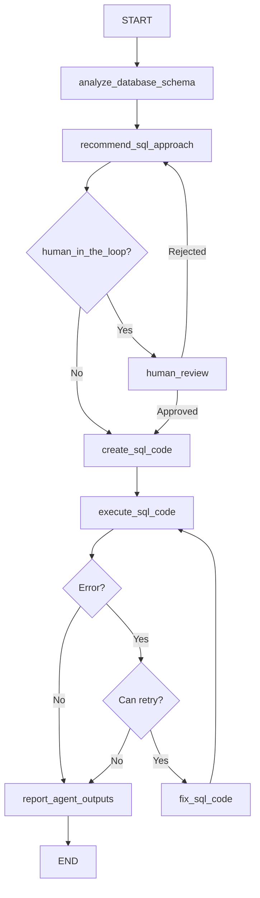

# SQLDatabaseAgent

## Purpose & Responsibilities

The SQLDatabaseAgent is responsible for interacting with SQL databases to perform queries, data transformations, and exploratory analysis based on user instructions. It generates SQL queries and Python code to manipulate database data, executes them, and provides the results. This agent can work both independently for database exploration and as part of a multiagent system where it serves as a data source for other agents.

The agent can:
- Generate and execute SQL queries to extract specific data
- Perform database schema analysis
- Create temporary tables and views
- Join multiple tables
- Conduct complex aggregations and filtering
- Generate summary statistics of database tables
- Transform SQL query results into pandas DataFrames for further processing
- Visualize database data through integration with other agents

## Core Implementation

The SQLDatabaseAgent extends the BaseAgent class and implements a state graph for database interactions:

```python
class SQLDatabaseAgent(BaseAgent):
    def __init__(
        self, 
        model, 
        connection_string=None, 
        connection=None,
        n_samples=30, 
        log=False, 
        log_path=None, 
        file_name="sql_query.py", 
        function_name="execute_sql",
        overwrite=True, 
        human_in_the_loop=False, 
        bypass_recommended_steps=False, 
        bypass_explain_code=False,
        checkpointer=None
    ):
        self._params = {
            "model": model,
            "connection_string": connection_string,
            "connection": connection,
            "n_samples": n_samples,
            "log": log,
            "log_path": log_path,
            "file_name": file_name,
            "function_name": function_name,
            "overwrite": overwrite,
            "human_in_the_loop": human_in_the_loop,
            "bypass_recommended_steps": bypass_recommended_steps,
            "bypass_explain_code": bypass_explain_code,
            "checkpointer": checkpointer
        }
        self._compiled_graph = self._make_compiled_graph()
        self.response = None

    def _make_compiled_graph(self):
        self.response = None
        return make_sql_database_agent(**self._params)
```

The agent uses the `make_sql_database_agent` factory function to create a state graph with nodes for:
1. Analyzing the database schema
2. Recommending SQL approach
3. Creating SQL code
4. Executing the code
5. Fixing code if errors occur
6. Human review (optional)
7. Reporting outputs

## Input/Output Schema

### Inputs
- **user_instructions** (str): Instructions for the SQL operation to perform
- **connection_string** (str, optional): Database connection string
- **connection** (SQLAlchemy.Connection, optional): Existing database connection
- **max_retries** (int, default=3): Maximum number of retry attempts for code generation
- **retry_count** (int, default=0): Current retry count

### Outputs
- **sql_result** (dict): Result of the SQL query in dictionary format (convertible to DataFrame)
- **sql_query_function** (str): Generated Python function for executing the SQL query
- **sql_query_function_path** (str): Path to the saved function file if logging is enabled
- **sql_error** (str): Error message if the query failed
- **messages** (list): List of messages generated during the process
- **recommended_steps** (str): Recommended SQL approach
- **database_schema** (str): Schema information for the target database

## State Management

The agent uses a TypedDict to define its state structure:

```python
class GraphState(TypedDict):
    messages: Annotated[Sequence[BaseMessage], operator.add]
    user_instructions: str
    recommended_steps: str
    database_schema: str
    sql_query_function: str
    sql_query_function_path: str
    sql_query_file_name: str
    sql_query_function_name: str
    sql_result: dict
    sql_error: str
    max_retries: int
    retry_count: int
```

State updates occur in node functions that return partial state updates:

```python
def recommend_sql_approach(state: GraphState):
    # Logic to analyze schema and recommend SQL approach
    return {
        "recommended_steps": steps_content,
        "messages": [...new messages...]
    }
```

The agent provides accessor methods for retrieving results:
- `get_sql_result()`
- `get_sql_query_function()`
- `get_database_schema()`
- `get_recommended_sql_approach()`

## Dependencies

- **Language Model**: Requires a LangChain-compatible LLM (e.g., ChatOpenAI)
- **sqlalchemy**: For database connection and management
- **pandas**: For data manipulation and query results handling
- **langgraph**: For state graph management
- **IPython.display**: For rendering query results and Markdown
- **ai_data_science_team.templates**: For agent templates and base implementation
- **ai_data_science_team.parsers.parsers**: For parsing model outputs
- **ai_data_science_team.utils.regex**: For code formatting utilities
- **ai_data_science_team.utils.sql**: For SQL utilities and schema extraction

## Communication Patterns

The SQLDatabaseAgent can operate in two modes:

1. As a standalone agent:
   ```python
   response = sql_database_agent.invoke_agent(
       user_instructions="Find all customers who made purchases over $1000",
       connection_string="sqlite:///sales.db"
   )
   result = sql_database_agent.get_sql_result()
   ```

2. As a component in a multiagent system, frequently paired with visualization agents:
   ```python
   def invoke_sql_database_agent(state):
       response = sql_database_agent.invoke({
           "user_instructions": state["query_instructions"],
           "connection_string": state["db_connection"],
           "max_retries": state["max_retries"]
       })
       return {
           "sql_result": response.get("sql_result", {}),
           "sql_query_function": response.get("sql_query_function", "")
       }
   ```

## Key Functions & Methods

### Public Methods
- `invoke_agent(user_instructions, connection_string=None, connection=None, max_retries=3, retry_count=0, **kwargs)`: Synchronously executes SQL operations
- `ainvoke_agent(user_instructions, connection_string=None, connection=None, max_retries=3, retry_count=0, **kwargs)`: Asynchronously executes SQL operations
- `get_workflow_summary(markdown=False)`: Returns a summary of the workflow
- `get_log_summary(markdown=False)`: Returns a summary of the logged operations
- `get_sql_result(as_dataframe=True)`: Returns the SQL query result
- `get_sql_query_function(markdown=False)`: Returns the generated function
- `get_database_schema(markdown=False)`: Returns the database schema
- `get_recommended_sql_approach(markdown=False)`: Returns the recommended SQL approach

### Internal Node Functions
- `analyze_database_schema(state)`: Analyzes and extracts database schema
- `recommend_sql_approach(state)`: Recommends SQL queries and operations
- `create_sql_code(state)`: Generates Python code for SQL operations
- `execute_sql_code(state)`: Executes the generated code
- `fix_sql_code(state)`: Fixes code when errors occur
- `human_review(state)`: Allows human review of the recommendations
- `report_agent_outputs(state)`: Generates a final report

## Configuration Options

- **model**: The language model used for code generation
- **connection_string** (str, optional): Database connection string
- **connection** (SQLAlchemy.Connection, optional): Existing database connection
- **n_samples** (int, default=30): Number of samples to use when summarizing query results
- **log** (bool, default=False): Whether to log the generated code and errors
- **log_path** (str, default=None): Directory for storing log files
- **file_name** (str, default="sql_query.py"): Name for the generated code file
- **function_name** (str, default="execute_sql"): Name of the generated function
- **overwrite** (bool, default=True): Whether to overwrite existing log files
- **human_in_the_loop** (bool, default=False): Enables user review of recommendations
- **bypass_recommended_steps** (bool, default=False): Skips the recommendation step
- **bypass_explain_code** (bool, default=False): Skips code explanation
- **checkpointer** (Checkpointer, default=None): For state persistence

## Execution Flow



## Fetch.ai uAgents Translation Notes

### Protocol Mapping

The SQLDatabaseAgent's state graph nodes map to uAgent protocols:

```python
from uagents import Agent, Context, Protocol, Message

class SQLDatabaseProtocol(Protocol):
    # Main processing protocol
    request_schema = {
        "type": "object",
        "properties": {
            "user_instructions": {"type": "string"},
            "connection_string": {"type": "string"},
            "max_retries": {"type": "integer"},
            "retry_count": {"type": "integer"}
        },
        "required": ["user_instructions"]
    }
    
    response_schema = {
        "type": "object",
        "properties": {
            "sql_result": {"type": "object"},
            "sql_query_function": {"type": "string"},
            "sql_error": {"type": "string"},
            "recommended_steps": {"type": "string"},
            "database_schema": {"type": "string"}
        }
    }
```

### Implementation Structure

```python
class SQLDatabaseUAgent(Agent):
    def __init__(self, model, connection_string=None, n_samples=30, 
                 log=False, log_path=None, function_name="execute_sql", 
                 human_in_the_loop=False):
        super().__init__(
            name="sql_database_agent",
            endpoint=["http://localhost:8000/sql-database"]
        )
        self.model = model
        self.connection_string = connection_string
        self.n_samples = n_samples
        self.log = log
        self.log_path = log_path
        self.function_name = function_name
        self.human_in_the_loop = human_in_the_loop
        
        # Initialize state
        self.state = SQLDatabaseState()
        
        # Database connection is created when needed
        self.connection = None
        
        # Register protocols
        self.add_protocol(SQLDatabaseProtocol())
        
    @protocol_handler("execute_sql")
    async def execute_sql(self, ctx: Context, sender: str, msg: Message):
        # Extract data from message
        self.state.user_instructions = msg.data["user_instructions"]
        
        # Use provided connection string or default
        connection_string = msg.data.get("connection_string") or self.connection_string
        if not connection_string:
            await ctx.send(
                sender,
                Message(
                    protocol="execute_sql_response",
                    performative="inform",
                    content={
                        "sql_error": "No database connection string provided"
                    }
                )
            )
            return
            
        self.state.max_retries = msg.data.get("max_retries", 3)
        self.state.retry_count = msg.data.get("retry_count", 0)
        
        # Save initial state
        await self.storage.set("initial_state", self.state.to_dict())
        
        # Start processing workflow
        try:
            # Create database connection
            self.connection = await self._create_connection(connection_string)
            
            # Start with schema analysis
            await self._analyze_database_schema(ctx, sender)
        except Exception as e:
            await ctx.send(
                sender,
                Message(
                    protocol="execute_sql_response",
                    performative="inform",
                    content={
                        "sql_error": f"Connection error: {str(e)}"
                    }
                )
            )
```

### Schema Analysis Implementation

```python
async def _analyze_database_schema(self, ctx: Context, sender: str):
    try:
        # Extract schema information
        schema_info = await self._extract_schema(self.connection)
        
        # Update state
        self.state.database_schema = schema_info
        
        # Log message
        await self._append_message("SQL Database Agent", 
                                  f"Database schema analyzed successfully")
        
        # Continue to next step
        await self._recommend_sql_approach(ctx, sender)
    except Exception as e:
        # Send error response
        await ctx.send(
            sender,
            Message(
                protocol="execute_sql_response",
                performative="inform",
                content={
                    "sql_error": f"Schema analysis error: {str(e)}"
                }
            )
        )
```

### State Management

```python
class SQLDatabaseState:
    def __init__(self):
        # Input state
        self.user_instructions = None
        self.max_retries = 3
        self.retry_count = 0
        
        # Processing state
        self.database_schema = None
        self.recommended_steps = None
        self.sql_query_function = None
        self.sql_query_function_path = None
        self.sql_query_file_name = "sql_query.py"
        self.sql_query_function_name = "execute_sql"
        
        # Output state
        self.sql_result = None
        self.sql_error = None
        self.messages = []
    
    def to_dict(self):
        return {k: v for k, v in vars(self).items() 
                if not k.startswith('_')}
    
    @classmethod
    def from_dict(cls, data):
        state = cls()
        for k, v in data.items():
            if hasattr(state, k):
                setattr(state, k, v)
        return state
```

### SQL Execution Implementation

```python
async def _execute_sql_code(self, ctx: Context, sender: str):
    try:
        # Execute the generated code
        function_code = self.state.sql_query_function
        
        # Safe execution in isolated environment with database connection
        result = await self._safe_execute_sql(function_code, self.connection)
        
        # Convert result to dictionary if it's a DataFrame
        if hasattr(result, 'to_dict'):
            result = result.to_dict()
            
        # Update state with successful result
        self.state.sql_result = result
        self.state.sql_error = ""
        
        # Send completion message
        await ctx.send(
            sender,
            Message(
                protocol="execute_sql_response",
                performative="inform",
                content={
                    "sql_result": self.state.sql_result,
                    "sql_query_function": self.state.sql_query_function,
                    "recommended_steps": self.state.recommended_steps,
                    "database_schema": self.state.database_schema,
                    "sql_error": ""
                }
            )
        )
    except Exception as e:
        # Handle error
        self.state.sql_error = str(e)
        self.state.retry_count += 1
        
        if self.state.retry_count < self.state.max_retries:
            # Attempt to fix the code
            await self._fix_sql_code(ctx, sender)
        else:
            # Send error response
            await ctx.send(
                sender,
                Message(
                    protocol="execute_sql_response",
                    performative="inform",
                    content={
                        "sql_error": self.state.sql_error,
                        "recommended_steps": self.state.recommended_steps,
                        "sql_query_function": self.state.sql_query_function,
                        "database_schema": self.state.database_schema
                    }
                )
            )
```

### Connection Management

```python
async def _create_connection(self, connection_string):
    """Create a database connection from a connection string"""
    from sqlalchemy import create_engine
    from sqlalchemy.ext.asyncio import create_async_engine
    
    # Check if it's an async connection string
    if connection_string.startswith(('postgresql+asyncpg', 'mysql+aiomysql', 'sqlite+aiosqlite')):
        engine = create_async_engine(connection_string)
        return await engine.connect()
    else:
        engine = create_engine(connection_string)
        return engine.connect()
    
async def _close_connection(self):
    """Close the database connection if it exists"""
    if self.connection:
        try:
            await self.connection.close()
        except:
            # If it's not an async connection
            self.connection.close()
        finally:
            self.connection = None
```

This translation preserves the core capabilities of the LangGraph-based SQLDatabaseAgent while adapting to the Fetch.ai uAgents framework, enabling SQL database interactions through an agent-based architecture. 